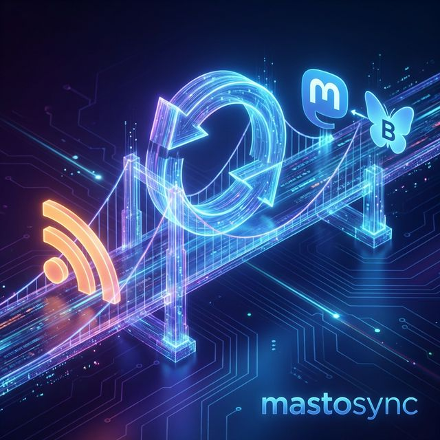
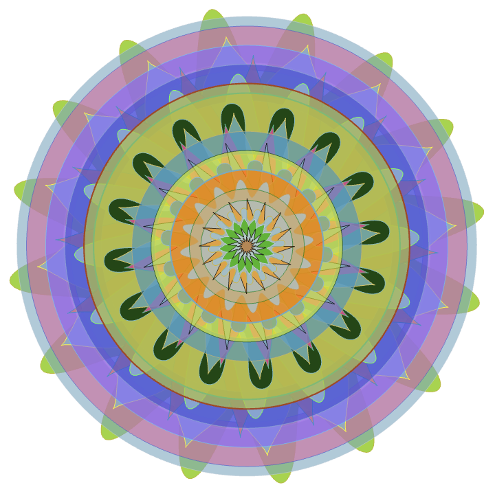
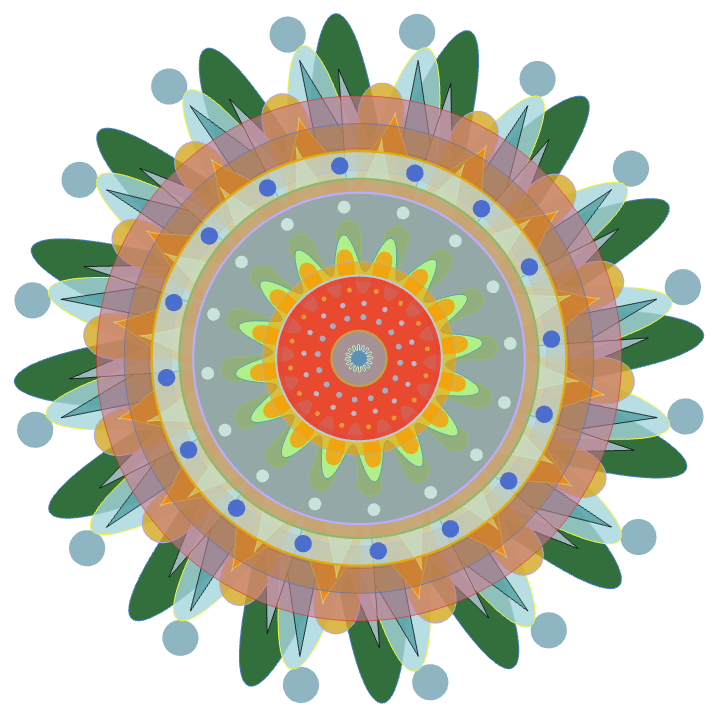
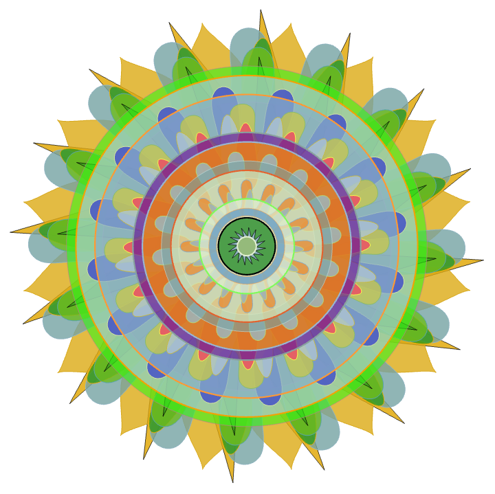
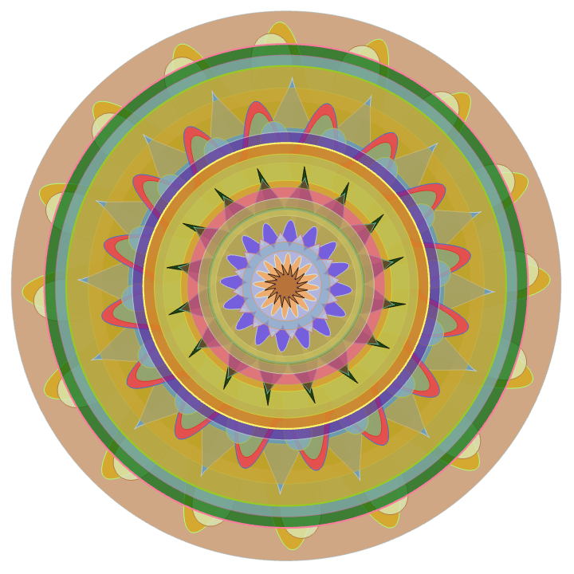
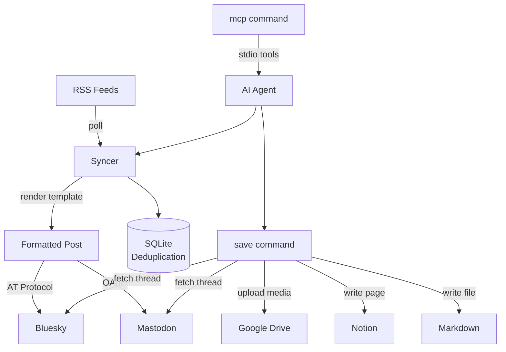

# 🐘🦋 mastosync

**mastosync** is a Go CLI that bridges RSS feeds with the decentralized social web. Post automatically to **Mastodon** or **Bluesky**, archive threads to **Notion** or Obsidian, and expose everything as an **MCP server** for AI agents.

> [!CAUTION]
> **Use at your own risk.** This tool was crafted with speed and specific needs in mind. Always verify your configuration before running it in production.

## Table of Contents

- [Features](#features)
- [Quick Start](#quick-start)
- [Commands](#commands)
  - [init](#init)
  - [sync](#sync)
  - [catchup](#catchup)
  - [chain](#chain)
  - [save](#save)
  - [auth](#auth)
  - [mandala](#mandala)
  - [mcp](#mcp)
- [Configuration](#configuration)
- [How It Works](#how-it-works)
- [Installation & Building](#installation--building)
  - [Using go install](#using-go-install)
  - [Using Bazel](#using-bazel)
  - [Using Go](#using-go)

<a id="features"></a>
## ✨ Features

- **Multi-Platform Syncing**: Post from RSS feeds to Mastodon or Bluesky using customizable Go templates.
- **Smart Archiving**: Capture Mastodon toots or Bluesky threads (including full reply chains) into Notion or local Obsidian-ready Markdown.
- **Media Handling**: Automatic image downloading, SHA-256 deduplication, format normalization, and Google Drive upload for permanent media hosting.
- **Thread Chaining**: Split a long text file into a coherent chain of connected posts.
- **Mandala Integration**: Generate and post Mathematica mandalas to both Mastodon and Bluesky simultaneously.
- **MCP Server Mode**: Run as a Model Context Protocol server so AI agents (Claude, Gemini, etc.) can drive all commands as tools.
- **Deduplication**: SQLite-backed state ensures feed items are never posted twice.

<a id="quick-start"></a>
## 🚀 Quick Start

```bash
# 1. Install
go install github.com/uwedeportivo/mastosync@latest

# 2. Create the config directory with skeleton config and templates
mastosync init

# 3. Edit ~/.mastosync/config.yaml with your credentials

# 4. Post new RSS items to Mastodon
mastosync sync

# 5. Post new RSS items to Bluesky instead
mastosync sync --sky
```

<a id="commands"></a>
## 📋 Commands

All commands accept a global `--config <path>` flag that points to the config directory (default: `~/.mastosync`).

---

<a id="init"></a>
### `init` (alias: `i`)

Create the config directory, skeleton `config.yaml`, default templates, and the SQLite databases.

```bash
mastosync init
mastosync init --config /path/to/custom/dir
```

Running `init` creates:

```
~/.mastosync/
├── config.yaml          # credentials and feed configuration
├── sync.sqlite3         # deduplication DB for Mastodon
├── skysync.sqlite3      # deduplication DB for Bluesky
├── templates/           # Go templates for Mastodon posts
│   └── someA.tmpl
└── skytemplates/        # Go templates for Bluesky posts
    └── someA.tmpl
```

---

<a id="sync"></a>
### `sync` (alias: `s`)

Fetch all configured RSS feeds, render each new item through its template, and post to Mastodon (default) or Bluesky.

```bash
mastosync sync [--sky] [--dryrun]
```

| Flag | Description |
|------|-------------|
| `--sky` | Post to Bluesky instead of Mastodon. Uses `skyfeeds` and `skytemplates` from config. |
| `--dryrun` | Parse and render without actually posting anything. |

**Example:**
```bash
# Sync to Mastodon (live)
mastosync sync

# Preview what would be posted to Bluesky
mastosync sync --sky --dryrun
```

Each feed entry in `config.yaml` maps an RSS URL to a template file. Templates receive `.Title`, `.Description`, and `.Link` from the feed item.

---

<a id="catchup"></a>
### `catchup` (alias: `c`)

Mark all current feed items as already posted **without** actually posting them. Use this when adding a new feed to avoid flooding your timeline with historical entries.

```bash
mastosync catchup [--sky]
```

| Flag | Description |
|------|-------------|
| `--sky` | Catchup the Bluesky database (`skysync.sqlite3`). |

**Example:**
```bash
# Add a new feed to config.yaml, then catchup before syncing
mastosync catchup
mastosync sync
```

---

<a id="chain"></a>
### `chain` (alias: `x`)

Read a plain text file, split it into toot-sized chunks at sentence boundaries, and post them as a reply chain on Mastodon.

```bash
mastosync chain --toots <path-to-file> [--dryrun]
```

| Flag | Description |
|------|-------------|
| `--toots <path>` | Path to the text file to post. Required. |
| `--dryrun` | Print the split posts without sending them. |

**Example:**
```bash
mastosync chain --toots ~/drafts/longpost.txt
mastosync chain --toots ~/drafts/longpost.txt --dryrun
```

The tokenizer splits on sentence boundaries to keep each post under the Mastodon character limit while preserving readability.

---

<a id="save"></a>
### `save` (alias: `n`)

Archive a single Mastodon toot or Bluesky post (and its full thread) to **Notion** or a local **Markdown file**. Media is downloaded, deduplicated, and uploaded to Google Drive for permanent hosting.

```bash
mastosync save [--title <string>] [--dir <path>] [--external] [--dryrun] [--debug] <status-id-or-url>
```

The argument can be:
- A Mastodon status URL: `https://mastodon.social/@user/123456`
- A Mastodon status ID: `123456789012345678`
- A Bluesky post URL: `https://bsky.app/profile/handle.bsky.social/post/abc123`
- A Bluesky AT-URI: `at://did:plc:xxx/app.bsky.feed.post/abc123`

| Flag | Description |
|------|-------------|
| `--title <string>` | Page title in Notion. Defaults to the post's first line. |
| `--dir <path>` | Save as a Markdown file in this directory instead of Notion. |
| `--external` | Skip Google Drive upload; embed the Mastodon server's original media URLs. |
| `--dryrun` | Fetch and process without writing to Notion or disk. |
| `--debug` | Print verbose output during processing. |

**Examples:**
```bash
# Save to Notion with a custom title
mastosync save --title "Interesting thread" https://mastodon.social/@user/109876543210

# Save a Bluesky thread to a local Markdown file
mastosync save --dir ~/notes https://bsky.app/profile/user.bsky.social/post/3abc

# Save without uploading media to Google Drive
mastosync save --external https://mastodon.social/@user/109876543210
```

---

<a id="auth"></a>
### `auth` (alias: `a`)

Perform the Google Drive OAuth2 flow and save the resulting token to `gdrive.token`. Run this once before using `save` with Google Drive media upload.

```bash
mastosync auth
```

This opens your browser to the Google consent screen, listens for the callback on `localhost:9999`, and writes the token to `~/.mastosync/gdrive.token`.

You must first place a `gdrive.json` OAuth client credentials file (downloaded from the Google Cloud Console) in your config directory:

```
~/.mastosync/
├── gdrive.json    # OAuth client credentials (you provide this)
└── gdrive.token   # OAuth token (written by `auth`)
```

---

<a id="mandala"></a>
### `mandala` (alias: `m`)

Generate a Mathematica mandala using `wolframscript` and post the resulting image to both Mastodon and Bluesky simultaneously.

```bash
mastosync mandala [--path <dir>] [--toot <text>]
```

| Flag | Default | Description |
|------|---------|-------------|
| `--path <dir>` | `/tmp` | Directory where `mandala.png` will be written and read from. |
| `--toot <text>` | _(empty)_ | Optional extra text appended to the Mastodon post. |

**Example:**
```bash
mastosync mandala --path ~/mandalas --toot "#GenerativeArt"
```

Requires the `mandala` script path to be set in `config.yaml` (passed to `wolframscript -file`).

**Example output:**

<table>
  <tr>
    <td></td>
    <td></td>
  </tr>
  <tr>
    <td></td>
    <td></td>
  </tr>
</table>

---

<a id="mcp"></a>
### `mcp`

Run mastosync as a [Model Context Protocol](https://modelcontextprotocol.io) server over stdio. AI agents (Claude, Gemini, etc.) can then call `sync`, `save`, `catchup`, `mandala`, and `chain` as structured tools.

```bash
mastosync mcp
```

Add it to your MCP client config (e.g. Claude Desktop's `claude_desktop_config.json`):

```json
{
  "mcpServers": {
    "mastosync": {
      "command": "mastosync",
      "args": ["mcp"]
    }
  }
}
```

Exposed tools mirror the CLI commands with identical parameters.

---

<a id="configuration"></a>
## ⚙️ Configuration

The config file lives at `~/.mastosync/config.yaml` by default (or the path passed to `--config`). Run `mastosync init` to generate a skeleton.

```yaml
mas:
  server: "https://mastodon.social"
  clientid: "your_client_id"
  clientsecret: "your_client_secret"
  accesstoken: "your_access_token"

bluesky:
  handle: "yourhandle.bsky.social"
  apikey: "your-app-password"

feeds:
  - feedurl: "https://example.com/feed.xml"
    template: "someA.tmpl"
  - feedurl: "https://other.com/rss"
    template: "someB.tmpl"

skyfeeds:
  - feedurl: "https://example.com/feed.xml"
    template: "someA.tmpl"

notiontoken: "secret_xxxxxxxxxxxx"
notionparent: "notion-page-id-for-saved-posts"

# Google Drive folder ID for media storage
parent: "google-drive-folder-id"

# Path to the Mathematica script for mandala generation
mandala: "/path/to/mandala.wls"

# Mastodon bridge hostname (used for media URL rewriting when saving)
bridge: "your.bridge.host"
```

### Templates

Templates use Go's `text/template` syntax and receive the following fields from the RSS feed item:

| Field | Description |
|-------|-------------|
| `.Title` | Feed item title |
| `.Description` | Feed item description/summary |
| `.Link` | Feed item URL |

**Default Mastodon template** (`templates/someA.tmpl`):
```
{{.Title}}

{{.Description}}

{{.Link}}
```

**Default Bluesky template** (`skytemplates/someA.tmpl`):
```
{{.Description}}
```

Place template files in `~/.mastosync/templates/` (Mastodon) or `~/.mastosync/skytemplates/` (Bluesky) and reference them by filename in `config.yaml`.

---

<a id="how-it-works"></a>
## 🏗️ How It Works



1. **RSS Ingestion**: Fetches configured feeds and checks each item's GUID against the SQLite database.
2. **Deduplication**: Items already in `sync.sqlite3` or `skysync.sqlite3` are skipped.
3. **Template Rendering**: New items are rendered through the feed's assigned `.tmpl` file.
4. **API Dispatch**: Posts to Mastodon via OAuth or to Bluesky via ATproto XRPC.
5. **Media Pipeline** (save): Downloads attachments, hashes with SHA-256, uploads to Google Drive, and embeds permanent links in the Notion page or Markdown file.

---

<a id="installation--building"></a>
## 🛠️ Installation & Building

<a id="using-go-install"></a>
### Using go install

```bash
go install github.com/uwedeportivo/mastosync@latest
```

<a id="using-bazel"></a>
### Using Bazel

```bash
git clone https://github.com/uwedeportivo/mastosync
cd mastosync
bazel build //:mastosync
./bazel-bin/mastosync_/mastosync --help
```

<a id="using-go"></a>
### Using Go

```bash
git clone https://github.com/uwedeportivo/mastosync
cd mastosync
go build -o mastosync .
./mastosync --help
```

---

> [!TIP]
> For Bluesky, use an **App Password** generated from your account settings (`Settings → Privacy and Security → App Passwords`) rather than your main account password.

## 📄 License

Distributed under the [MIT](LICENSE) License.
